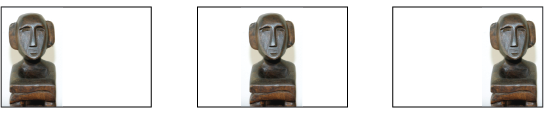
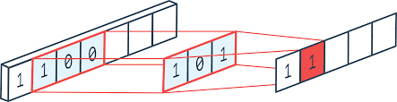
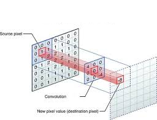
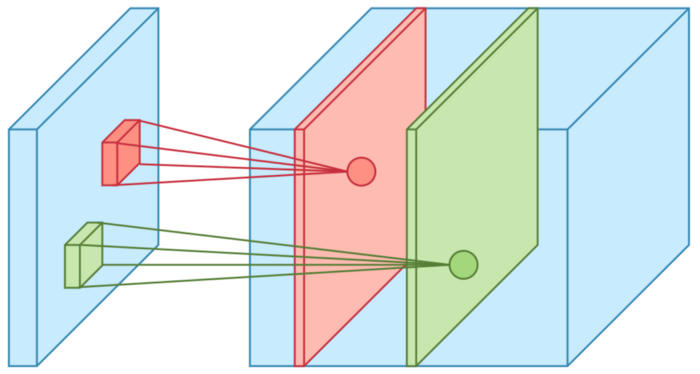
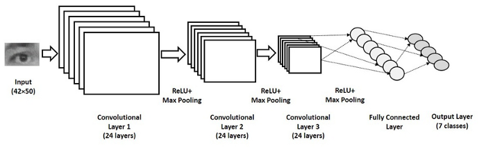

## Les réseaux convolutifs

### Limites des réseaux "standards"

Les réseaux de neurones "standard" et **denses** ont d'indéniables qualités,
nous permettant d'effectuer aisément et efficacement de la **classification**
ou de la **régression** sur des données dont les **caractéristiques sont
*hétérogènes*.
Par exemple, si les données en entrée sont celle de la base des vins, où chaque
vin est caractérisé par une acidité, un ph... c'est vers ce type de réseau qu'il
faut se tourner.

En revanche, dans le cas de données de type sonore ou d'images, la situation
change un peu :

- le nombre de caracteristiques est souvent très grand
- toutes les caractéristiques sont de même type
- la position d'un pattern dans les données peut varier.

Ceci pose des problèmes aux réseaux "standard"

#### Explosion du nombre de paramètres

dans un problème, même relativement complexe de données hétérogènes, le nombre
de caractéristiques reste souvent relativement faible. Imaginons que l'on
cherche à classifier des êtres humains, on prendra un certain nombre
d'informations sur eux (taille, poid, salaire, joie de vivre,...).
Même en cherchant à travailler sur des données très précises, on obtiendra
souvent au maximum une centaine de caracteristiques.

Dans un réseau "standard" (dense), chaque neurone de la couche d'entrée aura
donc au maximum une centaine de paramètres à régler
(ses poids vers chaque caractéristique). Disons que l'on ait 10 neurones sur la
couche d'entrée, cela fera un millier de paramètres à régler (pour la seule
couche d'entrée)

Si maintenant on travaille sur des images de visages pour les reconnaitre,
le nombre de caractéristique devient rapidement très grand. Imaginons que l'on
travaille avec des images de taille 256x256 (ce qui reste modeste), le nombre
de caractéristiques en entrée passe à 65536.

Un réseau dense travaillant sur ces images est composé de neurones qui regardent
tous tous les pixels, et définit le poid relatif de chaque pixel pour lui.
Un tel réseau, avec une première couche toujours composée de 10 neurones aura
maintenant 655360 paramètres libres à régler.

Ceci, si la base d'exemples n'est pas assez grande, risque fort de conduire à
du **sur apprentissage** (ou **overfitting** en anglais).

#### Importance des structures locales

Prenons l'exemple d'une base très classique :
la base MNIST dont voici quelques exemples.

Celle ci est composée de chiffres manuscrits, de taille similaires et centrés
dans des images de 28x28 pixels. L'objectif est ici de concevoir un classifieur
capable de reconnaitre quel chiffre est présenté (10 possibilités)

Dans de telles images, on peut penser que pour reconnaitre les chiffres, il
pourrait être interessant de détecter des motifs simples
(des portions verticales, des portions arrondies, des portions de telle ou telle
orientation) puis que la composition de ces portions conduisent à la
reconnaissance d'un chiffre.

De la même façon, pour la reconnaissance de visage, on peut imaginer qu'il
serait efficace d'avoir des motifs simples (les mêmes que précédement)
qui, combinés d'une certaine manière, conduisent a reconnaitre par exemple
des cercles, et qu'une combinaison de cercles amène a penser qu'on "voit" un
oeil...

Un réseau standard ne fonctionne pas du tout comme ceci (les réseaux convolutif
le feront)

#### Non invariance en translation

Enfin, un dernier problème est lié au précédent :
Par exemple, dans l'image suivante, le même motif apparait dans 3 images
différentes, mais sa position a changée :

Dans ce genre d'exemple, un réseau de neurone "standard" entrainé a reconnaitre
ce motif quand il est centré ne pourra pas le reconnaitre lorsqu'il est décalé.

### Principe des Réseaux de Neurones Convolutifs

On les appelle aussi *Convolutional Neural Networks* ou **CNN** en anglais.

L'idée de base est de se concentrer sur cette idée de structure locale a
détecter.

#### La convolution

On peut imaginer une portion de couche d'un CNN comme un neurone unique qui va
parcourir les données d'entrée en n'en voyant qu'une partie à la fois et
fournira une réponse pour chaque partie qu'il voit.

Pour mieux comprendre cette idée, imaginons la suite de valeurs suivante en
entrée :

[0,1,1,-3,4,4,8, -10,-10,0]

Imaginons de plus que :
- notre neurone regarde 2 valeurs consécutives de cette
suite.
- Ses poids, fixés ici pour l'exemple seront respectivement
[-1/2, 1/2]
- son biais sera nul, et sa fonction d'activation sera l'identité

Quelle seront les sorties de ce neurone ?

Si il regarde les 2 premieres valeurs de la suite d'entrée, il effectue la somme
suivante : -1/2x0 + 1/2x1 -> 1/2

Si il regarde les 2 valeurs suivantes de la suite d'entrée, il effectue la somme
suivante : -1/2x1 + 1/2x1 -> 0

De fait, ce neurone calcule une approximation de la dérivée :
(valeur en un point - valeur au point précédent) /2

En déroulant le long de la suite, on obtient la suite suivante :
[1/2,0,-2,3.5,0, 2,-9,0 ]

On a effectué la **convolution** du signal d'entrée par le filtre [-1/2,1/2].
(en fait, c'est une *correlation* mais c'est très semblable)

Notre neurone est ici une machine capable de signaler par une sortie forte
des transitions importantes gauche/droite, par des valeurs très négatives des
transitions importantes droite/gauche et des valeurs faibles les zones sans
grande variation

Un petit résumé en image, avec un filtre différent :

On peut donc penser cette opération comme un neurone unique qui parcourt les
données en entrées. On peut également le penser comme un ensemble de neurones
qui regardent chacun une portion des données en entrée, **tous ces neurones
ayant le même ensemble de poids**.

On peut également faire le même type d'opération sur des données 2D, avec un
filtre éventuellement 2D, comme dans l'image suivante :

ou animé :

#### Remarques sur la convolution

Ceci est moins majeur, mais je le place la quand même pour les curieux :

- la taille du filtre doit etre fixée par le programmeur (on peut créer un
filtre comme [1/4, 1/4, 1/4, 1/4] qui fait une moyenne des poids des 4 entrées
consécutives ou un filtre comme [1/3, 1/3, 1/3] qui fait la meme chose sur
3 entrées consécutives).

- Quand le neurone parcourt l'image, on peut choisir de le déplacer d'une
position à la suivante ou de lui faire sauter une ou plusieurs positions.
c'est le **pas** de la convolution
(ou **stride** en anglais quand on codera ceci).

- Quand on déplace le neurone, certaines positions à droite ne peuvent être
calculées (la dernière dans le cas de notre filtre de longueur 2).
La sortie est donc plus courte que l'entrée, a moins qu'on ajoute des zéros
autour pour que toutes les positions puissent être calculées
(on parle alors de **padding**). Sinon, si le filtre est de taille n, la sortie
est perd n-1 positions par rapport à l'entrée.

### Les Maps de caractéristiques

En fait, dans un CNN, une couche n'est pas composée d'un seul neurone, mais de
plusieurs. Chaque neurone va effectuer son filtrage et fournir une **map**
en sortie.

Une illustration de ceci :

C'est le développeur qui choisit la profondeur de sa couche (le nombre de maps)

La couche suivante va pouvoir regarder toutes les maps de la couche précédente comme des entrées. Un de ses neurones regardera toujours une portion de taille donnée mais toute la profondeur de la couche précédente.

Notons par exemple que si notre réseau doit traiter des images RGB, on peut
considérer qu'il travaille en fait sur des entrées réparties en 3 maps (R,G,B)

**Important** : Comme dans tout réseau de neurones, les poids ne sont pas
prédéterminés mais **appris**.

Dans un contexte d'images en entrées, c'est bien lors de l'apprentissage que,
par exemple, la première couche va décider que sa première map va se spécialiser
dans la détection de structures verticales, la seconde map dans la détection de
structures obliques.
Ceci est guidé par les performances en apprentissage.

L'extraction des caractéristiques analysées par le réseau sera donc induit par
les données et l'objectif du réseau. C'est la raison principale du succès des
CNN dans de nombreuses applications (notamment en traitement d'images)

#### Quelques considérations sur les taille en entrée et sortie des couches.

Ceci n'est pas majeur, mais amène a bien comprendre les architectures de
couches.

Imaginons qu'une couche travaille sur des données en entrée de taille :

100 (hauteur) x 200 (largeur) x 10 (nb de map)

Si ma couche est constituée comme suit :
- 15 maps calculées
- des noyaux (filtres) de taille 3x3
- pas (stride) de 1
- pas de padding

Alors les données en sortie ont pour dimensions :
98 (hauteur) x 198 (largeur) x 15 (nb de map)

On peut également calculer son nombre de paramètres libres :
chaque map de la couche voit 3x3x10 pixels d'entrées, et un biais
Pour chaque map de la couche, j'ai donc 91 paramètres.
Pour l'ensemble de la couche, j'ai donc 91x15 paramètres -> 1365 paramètres.

#### Vers une extraction de caractéristiques plus sémantiques...

Si l'on observe le fonctionnement d'un CNN a plusieurs couches, on peut
maintenant avoir l'intuition suivante :
- la première couche détecte des caractéristiques bas niveau (forte intensité, faible intensité, gradient dans une direction,...)
- la couche suivante va pouvoir intégrer ces caractéristiques bas niveau.
Elle pourrait ainsi avoir une map détectant des coins, ou des plus grandes lignes verticales...
- les couches suivantes font de même, détectant des structures de plus en plus
complexes dans l'image.

Ceci pourrait conduire a une map spécilaisée dans la détection d'yeux, ou de
canards...

Plus on progresse dans le réseau, plus on extrait une information complexe
des données d'origine.

**A noter** : Imaginez un réseau entrainé a reconnaitre toutes sortes d'animaux
et qui le fasse efficacement.
Il est vraisemblable que ses premières couches soient capables d'extraire des
informations très pertinentes pour toute sorte de problèmes (reconnaissance de
visages par exemple). Il est ainsi possible de prendre un réseau pré-entrainé
pour une tâche, d'en supprimer les couches finales pour les remplacer par
d'autres (non entrainées) et de lui faire apprendre uniquement sur ces couches
finales pour qu'il devienne rapidement efficace dans la reconnaissance de
visages. C'est ce que l'on appelle **Transfert Learning**)

### Les couches de pooling (sous echantillonage)

Dans un CNN, on a souvent une alternance d'une couche de convolution suivie
d'une couche de **pooling**. Voyons comment cela fonctionne avant d'en
comprendre l'intérêt.
Pour cela, prenons l'exemple de données 2D (une image).

Une couche de pooling a une taille donnée (souvent 2x2).
Une fois encore, on va se déplacer dans les données d'entrées, souvent avec un
pas de 2 (pour un poling de 2x2).

Dans le cas du **max pooling**, on regarde donc des blocs de 2x2 pixels, et on
ne conserve, sur chaque map d'entrée, que la valeur max des ces 4 pixels.
On a donc résumé l'information de ces 4 pixels en un seul. On réduit ainsi
la taille des données à traiter par les couches suivantes de façon drastique.
Il faut noter qu'on perd aussi de la précision sur la localisation de
l'information.

Ce qui semble être un désavantage est en fait intéressant, car la position
précise des caractéristique est moins importante que leurs positions relatives.
(par exemple, je n'ai pas besoin de savoir précisément ou sont les oreilles dans
un visage, mais c'est important de savoir qu'elles ne sont pas loin des yeux).
Ceci nous amènera a un peu de robustesse face au problème de l'invariance en
translation.

Si une couche de pooling 2x2 a pour entrée des données de taille :

100 (largeur) x 200 (hauteur) x 10 (nombre de map),

sa sortie aura une taille :

50 (largeur) x 100 (hauteur) x 10 (nombre de map)

Notons qu'il existe aussi des couches de **average pooling** qui donne en sortie
la valeur moyenne sur les 2x2 pixels de chaque map. Les calculs précédents sur
les tailles restent valables dans ce cas...

### Les couches finales

De fait, ces alternances de couches conv / pooling servent à extraire
l'information des données. Il manque la partie prise de décision
(classification ou régression).
Pour cela, il nous faudra une couche de sortie. Cette couche de sortie sera
"standard" (dense). Pour rappel, elle sera de taille 1 le plus souvent pour une
régression, ou ayant le même nombre de neurones que le nombre de classes pour
une classification.

Le problème est que ces couches denses travaillent sur des vecteurs 1D.
Or nos données sont, dans le cas d'images, des matrices 2D.
Il faudra donc une couche opérant la transformation.

Pour cela, 2 possibilités :
- une couche d'applatissement (**flatten**). Elle prendra en entrée une image de,
disons 100 (hauteur) x 200 (largeur) x 10 (nb map) et aura en sortie un
vecteur de taille 200x100x10 (hauteur x largeur x nb map).

- la seconde possibilité est de mettre une couche de **general pooling** (max ou
average). Celle ci fait un pooling sur chaque map. Pour notre entrée de
100 (hauteur) x 200 (largeur) x 10 (nb map). Elle aura en sortie un
vecteur de taille 10 (nb map).

### Architecture globale

Voici un exemple d'architecture complete de CNN avec une couche flatten avant la sortie :

### Premiers essais

A faire
